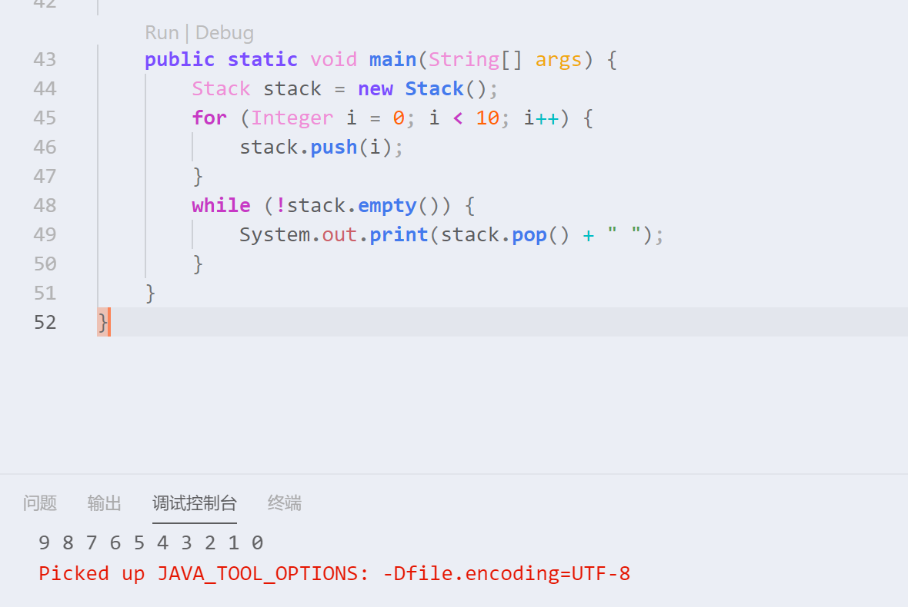

# 数据结构

数据结构只是数据的存储方式而已,为了让数据集合能够适用于一些场景,提出来的一些适用于特定场景的存储数据的方式.

## 栈

### 实现

基础的栈和队列就用一个实现和一个算法一笔带过吧.

栈是一个先进后出的数据结构,也就是说越早放进去的数据在读取时候的顺序就越靠后.

设想下栈所需要的方法.

> push()将数据存储到末尾
>
> pop()将最后存储的数据返回并从集合(栈)中删除
>
> peek()将最后存储的数据返回,不删除.
>
> empty()返回栈是否为空

我们设计实现一下这几个方法,实现如下.

```java
package basic.structure;

public class Stack {
    private Integer[] el;
    private Integer length;
    //利用构造函数初始化栈的长度.
    //利用java重载的特性,编写了两个构造函数,默认栈长度为10.
    //length设置为-1是为了方便索引,因为数组是从0开始索引的.
    public Stack(Integer length) {
        el = new Integer[length];
        this.length = -1;
    }
    public Stack() {
        el = new Integer[10];
        this.length = -1;
    }
    //当length=-1的时候证明栈还没有存放元素.
    public boolean empty() {
        return length == -1;
    }
    //判断栈是否存满
    //索引length+1后存储数据
    public void push(Integer element) {
        if (length < el.length) {
            el[++length] = element;
        }
    }
    //如果length是大于-1的,就将栈顶元素返回,并将该元素设置为null,长度-1
    public Integer pop() {
        if (length > -1) {
            Integer temp = el[length];
            el[length--] = null;
            return temp;
        }
        return null;
    }
    //将栈顶元素返回
    public Integer peek() {
        if (length > -1) {
            return el[length];
        }
        return null;
    }
}
```

这样一个最基本的栈就编写好了,写个main方法测试一下

```java
	public static void main(String[] args) {
        Stack stack = new Stack();
        for (Integer i = 0; i < 10; i++) {
            stack.push(i);
        }
        while (!stack.empty()) {
            System.out.print(stack.pop() + " ");
        }
    }
```



可以看到结果是倒叙输出的...

然而我们实现的这个栈泛用性太低了,只能存储integer类型的值,所以后续会完善该结构.

### 应用

实际上Java已经实现过栈这个数据结构了,所以我们其实是可以直接使用的.我们就用Java自带的栈来编写一个简单的判断括号有效性的算法吧~

判断规则:给定一个只包含"(){}[]"的字符串,如果所有的左括号对应存在右括号闭合,则判断为true,否则为false.

```java
	public boolean isValid(String s) {
        //new一个Stack实例,使用泛型确定它存储的为Character(字母)
        Stack<Character> res = new Stack<>();
        //将字符串转为字母数组
        char[] temp = s.toCharArray();
        //字符串必须以左括号开始.
        if (temp.length > 1 && temp[0] != '(' && temp[0] != '[' && temp[0] != '{')
            return false;
        //遍历循环列表
        for (char c : temp) {
            try {
                //如果是左括号,就push进栈
                switch (c) {
                case '(':
                    res.push(c);
                    break;
                case '[':
                    res.push(c);
                    break;
                case '{':
                    res.push(c);
                    break;
                //如果为右括号,则判断栈顶是否对应存在左括号,存在则pop出栈,否则返回false
                case ')':
                    if (res.peek() == '(') {
                        res.pop();
                        break;
                    } else
                        return false;
                case ']':
                    if (res.peek() == '[') {
                        res.pop();
                        break;
                    } else
                        return false;
                case '}':
                    if (res.peek() == '{') {
                        res.pop();
                        break;
                    } else
                        return false;
                }
            } catch (Exception e) {
                return false;
            }
        }
        //如果最终栈为空,则证明所有的左括号都有对应的右括号,即为有效.
        return res.empty();
    }
```

然后写一个main方法测试一下.

```java
	public static void main(String[] args) {
        BracketIsValid bracket = new BracketIsValid();
        System.out.println(bracket.isValid("({})"));
        System.out.println(bracket.isValid("({}"));
    }
```

应该输出true跟false.

该算法还是很简单的~毕竟只是基础的几个数据结构而已.