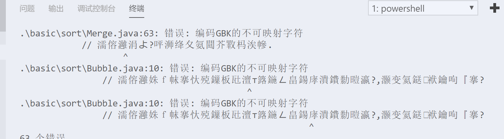
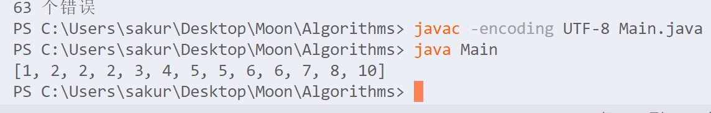

# 排序

首先根据面向接口编程的思想,定义一个接口Sort

```java
package basic.sort;

public interface Sort {
    void sort(int[] a);
}
```

很简单,只包含一个排序方法sort

## 冒泡排序

```java
package basic.sort;

public class Bubble implements Sort {
    @Override
    public void sort(int[] a) {
        //i来判断进行了几轮排序,最大轮次=数组长度-1
        for (int i = 0; i < a.length - 1; i++) {
            //j用来索引正在排序的数字所在的位置
            for (int j = 0; j < a.length - 1 - i; j++) {
                //如果正排序的数字大于在它后面的数字,就交换两者顺序
                if (a[j] > a[j + 1]) {
                    int temp = a[j];
                    a[j] = a[j + 1];
                    a[j + 1] = temp;
                }
            }
        }
    }
}
```

冒泡算法是最基础的算法,应该注释就够了,原理的话:


网上找到的容易看懂的图.

只比较相邻的元素,如果相邻元素的顺序相反的话就交换,一直将该轮次的数字交换到正确的位置.

因为数字是依次向上冒头,或许看着像冒泡吧...所以叫冒泡排序...

## 选择排序

```java
package basic.sort;

public class Selection implements Sort {
    @Override
    public void sort(int[] a) {
        //用i索引当前排序到第几个位置
        for (int i = 0; i < a.length - 1; i++) {
            //每一轮从未排序的元素中选择一个最小的数字来作为首位置的数字
            //注意该首位置表明的是当前排序到第几个数字了
            //比如排序到第二个数字,该首位置就是1,因为数组是从0开始索引的.
            int min = i;
            for (int j = i + 1; j < a.length; j++) {
                //利用j来判断i后面是否存在比当前首位置数字还小的数字.
                if (a[j] < a[min]) {
                    //如果a[j]<a[min]的话,就将j设置为最小位置的索引
                    min = j;
                }
            }
            //如果min发生了变化,表明实际i并不是最小的数字
            //就将i和实际最小数字所在位置进行交换
            if (min != i) {
                int temp = a[i];
                a[i] = a[min];
                a[min] = temp;
            }
        }
    }
}
```

简单说明一下选择排序吧

利用一个临时变量min,将目前遇到的最小的数字的索引位置存起来,如果碰到比该数字小的,就交换这两个数字的位置.

然后创建一个Main方法用来测试我们写好的排序.

```java
import basic.sort.Sort;
import basic.sort.Selection;

import java.util.Arrays;

public class Main {
    public static void main(String[] args) {
        Sort sort = new Shell();
        int[] a = new int[] { 2, 5, 4, 1, 3 };
        sort.sort(a);
        System.out.println(Arrays.toString(a));
    }
}
```

在终端执行命令

> javac Main.java
>
> java Main


对了,如果java文件中有中文注释,需要声明用-encoding utf-8进行编译,不然会出现编码错误.



所以如果有中文注释,我们显式用该命令编译

> javac -encoding UTF-8 Main.java



目前目录状况如下.


接下来就不一一赘述这些东西了...详情参考示例代码.

## 插入排序

```java
import basic.sort.Sort;

public class Insertion implements Sort {
    @Override
    public void sort(int[] a) {
        //i表示当前有几个数字是有序的
        for (int i = 1; i < a.length; i++) {
            //j表示未排序数字的所在位置
            for (int j = i; j > 0; j--) {
                //如果j的前一个比j小,就将它插到前面.
                if (a[j - 1] > a[j]) {
                    int temp = a[j];
                    a[j] = a[j - 1];
                    a[j - 1] = temp;
                }
            }
        }
    }
}
```

看着好像比选择排序还简单的样子233333

不过实际上效率要高出很多...简单说明:


对比从a[i]到a[0]之间的数字,如果a[i-1]>a[i],就交换顺序,每次只挪动一个位置.遍历一遍后依次将数字移动到正确的位置就可以了.

测试的时候将Main方法里的new Selection()修改为new Insertion()就可以了

## 希尔排序

希尔排序/Shell Sort是插入排序的改良版.

在观察插入排序的时候,每次都只交换一个位置,可能要交换很多次才能到正确的地方.那么我们就考虑尽可能地将它挪动到最远的地方.

在这里给出一个概念吧...2-有序,4-有序,8-有序的意思是,每隔x个的数字是有序的,至于x之间的数字则先不考虑...比如这个数组

>2,1,4,3,6,3,8,1,10

这个就是一个2-有序数组,因为2,4,6,8,10是有序的.

所以我们就考虑利用插入排序,每次不止挪动一个位置,而是x个位置,先让它变成x-有序就可以了.所以有如下实现

```java
package basic.sort;

public class Shell implements Sort {
    @Override
    public void sort(int[] a) {
        int N = a.length;
        int h = 1;
        //设置一个数字,表示每次挪动h个位置,希尔排序的性能取决于该数字的算法.
        //简单起见我只是将该数字设置小于length的最大2^n
        while (h < N / 2) h = 2 * h;
        while (h >= 1) {
            //下面类似插入排序了,只是每次如果需要插入,则直接插入到前面h个位置的地方
            for (int i = h; i < N; i++) {
                for (int j = i; j >= h; j -= h) {
                    if (a[j] < a[j - h]) {
                        int temp = a[j];
                        a[j] = a[j - h];
                        a[j - h] = temp;
                    }
                }
            }
            //将h/2,让它最终迭代为1-有序数组
            h = h / 2;
        }
    }
}
```

参考如上.我们先构造了一个尽可能大的数字,比如这里我们利用循环构造了一个数字2^n<a.length

比如length长度为20,那么h就是16,然后第一遍循环先看第16个数字跟第一个数字的大小,视情况交换,然后j=j-h...然后比较a[17]和a[1]......

第一遍结束后应该是个16-有序数组,然后让h=h/2,让这个数组变为8-有序,4-有序,2-有序,1-有序...

1-有序自然就是一个常规的有序列表了

还是很简单的...

## 归并排序

我们先写归并排序的原理吧:

归并排序是将两个有序数组归并为一个有序数组的算法,也就是说必须提供给它两个有序数组.

我们根据这个思路先将归并的算法写出来,然后再考虑两个数组不是有序的情况.

```java
package basic.sort;

public class Merge implements Sort {
    public int[] merge(int[] a, int[] b) {
        //新建一个数组,用来存放归并后的结果
        int[] result = new int[a.length + b.length];
        //i表示当前归并到第一个数组的第i个位置
        //j表示归并到第二个数组的第j个位置
        //k表示归并到结果数组的第k个位置
        int i = 0, j = 0, k = 0;
        while (i < a.length && j < b.length) {
            //判断左边数组的数组和右边数字的大小,将小的放在结果数组中
            //如果两者相等就都放进去.
            if (a[i] < b[j]) {
                result[k++] = a[i++];
            } else if (a[i] > b[j]) {
                result[k++] = b[j++];
            } else {
                result[k++] = a[i++];
                result[k++] = b[j++];
            }
        }
        //这两个循环是可能存在两个数组长度不相等的情况.
        while (i < a.length) {
            result[k++] = a[i++];
        }
        while (j < b.length) {
            result[k++] = b[j++];
        }
    }
}
```

这是提供两个有序数组时候的算法.不算难,那么考虑下如何利用该算法将一个无序数组归并为一个有序数组?

首先我们想想如何在一个数组中进行归并,我们可以人为的利用一个变量将一个数组分为两个,比如mid表示中间,将mid左右两边的数字分别利用上面的思路归并.

然后我们实现另一种归并算法

```java
	public int[] merge(int[] a) {
        int mid = a.length / 2;
        int[] result = new int[a.length];
    	//i表示数组左半边归并到第i个位置
        //j表示数组右半边归并到第i个位置
        //k表示结果数组归并到的位置
        int i = 0, j = mid + 1, k = 0;
        for (; k < a.length; k++) {
            //如果i>mid,说明左半边归并结束了,但是右半边还存在没有数组归并到结果中
            if (i > mid)
                result[k] = a[j++];
            //同上一个判断.
            else if (j > hi)
                result[k] = a[i++];
            //将较小的放到结果数组中.
            //其中相等的情况我们利用上面两个判断进行了归并,所以这里并不需要再进行多余的判断了
            else if (a[j] < a[i])
                result[k] = a[j++];
            else
                result[k] = a[i++];
        }
        return result;
    }
```

那么继续思考,怎么在两边都无序的情况下归并呢?

简单想想,我们可以利用递归.为什么利用递归呢?

如果数组中只有2个数字,那么左右半边两边是不是有序的呢?

如果数组中有4个数字,我们可以拆分为左右两个2个数字的数组对吧?

那么把左右两个数组排序好了后,这个4个数字的数组是不是就存在两个有序数组呢?

所以可以利用递归,从2个长度的数组开始归并,一直归并到整个数组就结束.

那么有如下的完整实现.

```java
public class Merge implements Sort {
    //我们声明一个临时变量,用来存放需要排序的数组,将结果放在原数组中
    //可以避免我们利用return来返回result结果
    private int[] aux;

    @Override
    public void sort(int[] a) {
        //实例化临时变量为排序数组的长度
        aux = new int[a.length];
        //利用另一个方法进行数组的递归拆分操作.
        //所以要先将排序数组完整的传给该方法.
        sort(a, 0, a.length - 1);
    }
	//用来递归拆分数组的排序方法.
    //lo表示数组的最低边界,hi表示数组的最高边界.
    private void sort(int[] a, int lo, int hi) {
        //最低边界大于最高边界,就返回.
        if (hi <= lo)
            return;
        //算出当前数组的中间位置
        int mid = lo + (hi - lo) / 2;
        //利用递归,将数组不断地拆分为两个
        sort(a, lo, mid);
        sort(a, mid + 1, hi);
        //第一次运行merge方法的时候,实际上lo是0,mid也是0,hi为1.
        //也就是上面说明原理的时候,只有两个数组的数组.
        //然后递归地将数组不断地归并,最终为一个有序数组.
        merge(a, lo, mid, hi);
    }

    private void merge(int[] a, int lo, int mid, int hi) {
        int i = lo, j = mid + 1;
        for (int k = lo; k <= hi; k++) {
            //将需要归并的数组中的数字复制到临时变量aux中
            aux[k] = a[k];
        }
        //利用上面的归并思路,将aux临时变量中的值一一归并到原数组中.
        for (int k = lo; k <= hi; k++) {
            if (i > mid)
                a[k] = aux[j++];
            else if (j > hi)
                a[k] = aux[i++];
            else if (aux[j] < aux[i])
                a[k] = aux[j++];
            else {
                a[k] = aux[i++];
            }
        }
    }
}
```

归并排序算法到这里就结束了~里面涉及的东西还是挺多的...我觉得这里开始排序算法才有一定难度了.递归这里如果不深入思考的话也是挺难想到如何实现的...

首先归并排序在数组长度较小时效率并不高,可以看到我们进行了很多的循环,但是在数组长度过长的时候可能就会有栈溢出报错的情况,所以递归实现并不算是一个最优解...

我们数据结构与算法中学习过如何将递归改造为栈,所以我们是可以通过一个栈的数据结构将递归进行改造,在随后有机会会进行改进.

至于优化归并排序本身性能的话,可以考虑在递归进行归并的时候,如果数组长度较小,也就是hi-lo比较小的时候,可以利用插入排序,插入排序在数组长度较小时是一个很好用的排序算法.