# 第1节: 环境配置

我们需要配置下列环境...虽然我给你配过了,不过万一你删掉了或者不好使了,还能看着重来一遍~

1. Java环境
2. Maven
3. IDEA

## Java环境

[Java SE](https://www.oracle.com/technetwork/java/javase/downloads/jdk8-downloads-2133151.html) Java SE 8官方链接,或许某一天可能就变了,所以最好百度搜Java SE

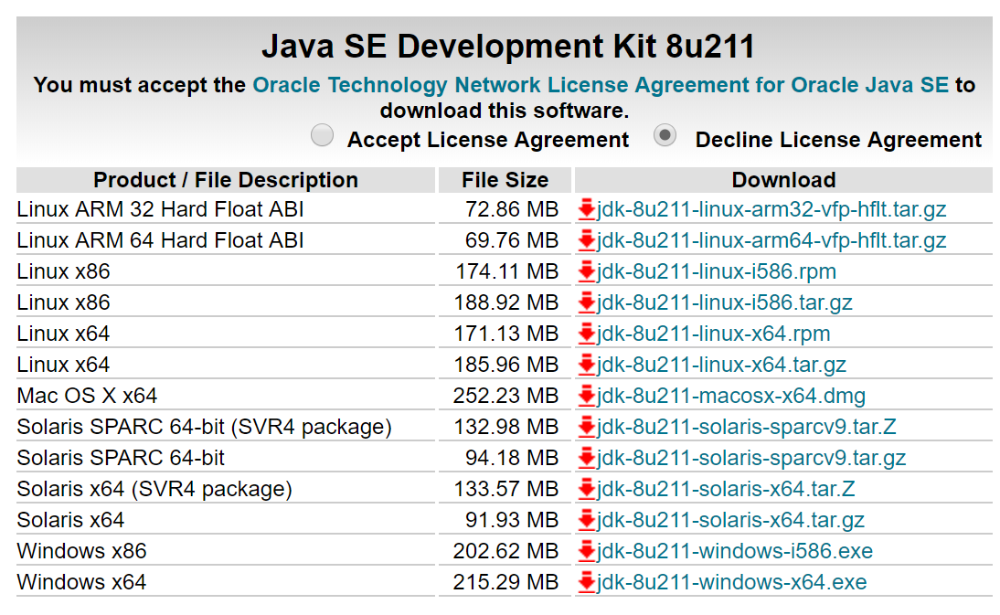

点击Accept License Agreement,然后下载最下面的Windows x64对应的jdk

一步步安装就可以了.

然后打开控制面板->系统和安全->系统->高级系统设置->环境变量.

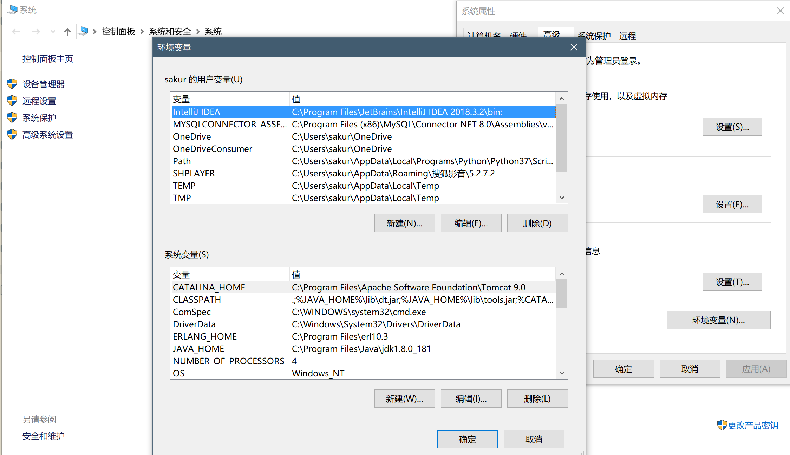

系统变量中添加

| 变量名                       | 变量值                                                       |
| ---------------------------- | ------------------------------------------------------------ |
| JAVA_HOME                    | C:\Program Files\Java\jdk1.8.0_181 (这里根据自己实际安装的jdk地址) |
| Path(该变量通常是已经存在的) | %JAVA_HOME%\bin                                              |
| Path                         | %JAVA_HOME%\jre\bin                                          |
| CLASSPATH(该变量通常存在)    | %JAVA_HOME%\lib\dt.jar;%JAVA_HOME%\lib\tools.jar; (添加到末尾) |

其中dt.jar是运行环境是用到的类库,tools.jar是使用javac命令进行编译时需要的Java工具.

这些环境变量其实就是告诉Windows,在你使用命令时对应到哪个目录去找该命令对应的工具,当然这些环境变量只有在使用命令行工具的时候才会派上用处,比如cmd,powershell.如果使用IDEA就不需要配这个...但是为了后续内容,还是需要用到命令行工具的.

配好后打开cmd或者powershell,分别输入命令:java -version和javac -version

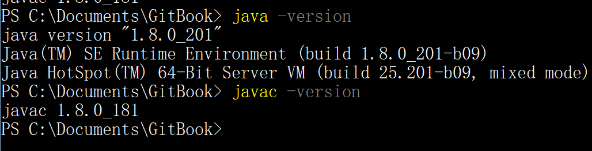

如果为如图结果,则环境变量配置好了,如果不行首先重启,再试试.

还不可以就检查自己的目录是否输入正确,有没有缺分号,检查jdk/lib目录下是否存在dt.jar和tools.jar

## Maven

Maven是一个包管理工具,同时它可以批量打包编写好的Java文件,发布到中央仓库...

简单说Maven是一个应用商店,可以通过输入名称来下载对应的Java应用程序.

[Maven](http://maven.apache.org/download.cgi) 官方下载地址

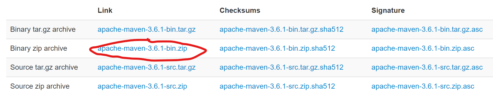

点击画圈部分下载,可能有些慢...稍微等等.然后解压到一个目录下.

继续添加系统环境变量,找到Path,添加如下

C:\Users\sakur\AppData\Local\Maven\apache-maven-3.6.0\bin

也就是解压后文件中的bin所在的目录

在cmd中输入mvn -v

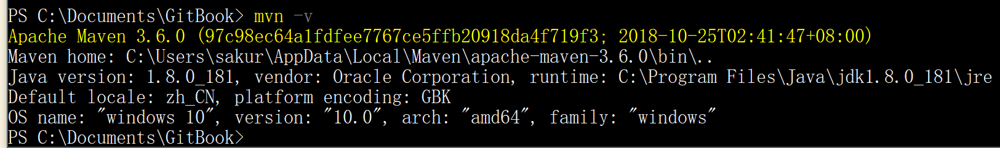

这样Maven就配置完成了~

然后打开apache-maven-3.1.0/conf目录下的setting.xml

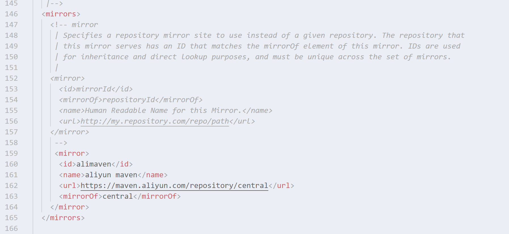

找到mirrors这一行部分,然后复制以下内容,结果如图就可以了

```xml
<mirror>
  <id>alimaven</id>
  <name>aliyun maven</name>
  <url>https://maven.aliyun.com/repository/central</url>
  <mirrorOf>central</mirrorOf>        
</mirror>
```

不配置这个的话...下载java包会比较慢...这个是使用阿里的应用镜像

然后再快结束的地方找到这个对应的地方,复制粘贴如下代码,结果如图就可以

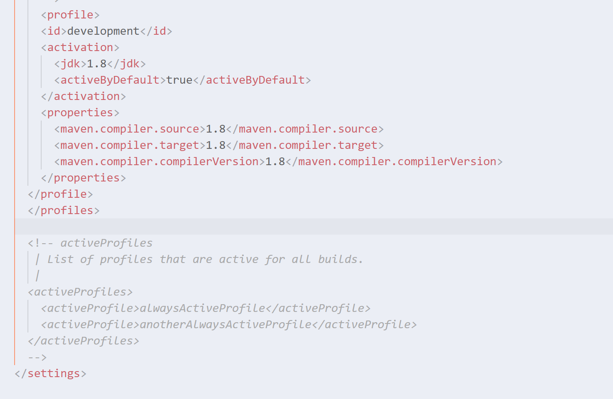

```xml
<profile>
    <id>development</id>
    <activation>
      <jdk>1.8</jdk>
      <activeByDefault>true</activeByDefault>
    </activation>
    <properties>
      <maven.compiler.source>1.8</maven.compiler.source>
      <maven.compiler.target>1.8</maven.compiler.target>
      <maven.compiler.compilerVersion>1.8</maven.compiler.compilerVersion>
    </properties>
  </profile>
```

这个是告诉Maven默认我们的Java版本,和生成的结果版本,因为我们使用的是Java SE8,是1.8版本.

## IDEA

我记得应该给你下载过了吧...如果你删掉了......唉...我也不晓得网上现在的破解方法好不好使...如果有学校的学生邮箱的话就比较好解决了~可以免费用到毕业~

[IDEA 学生认证](https://www.jetbrains.com/student/)

[JetBrains](https://www.jetbrains.com/toolbox/app/?fromMenu) 这个是ToolBox...可以在里面下载常用的IDE,它家的IDE都很好用

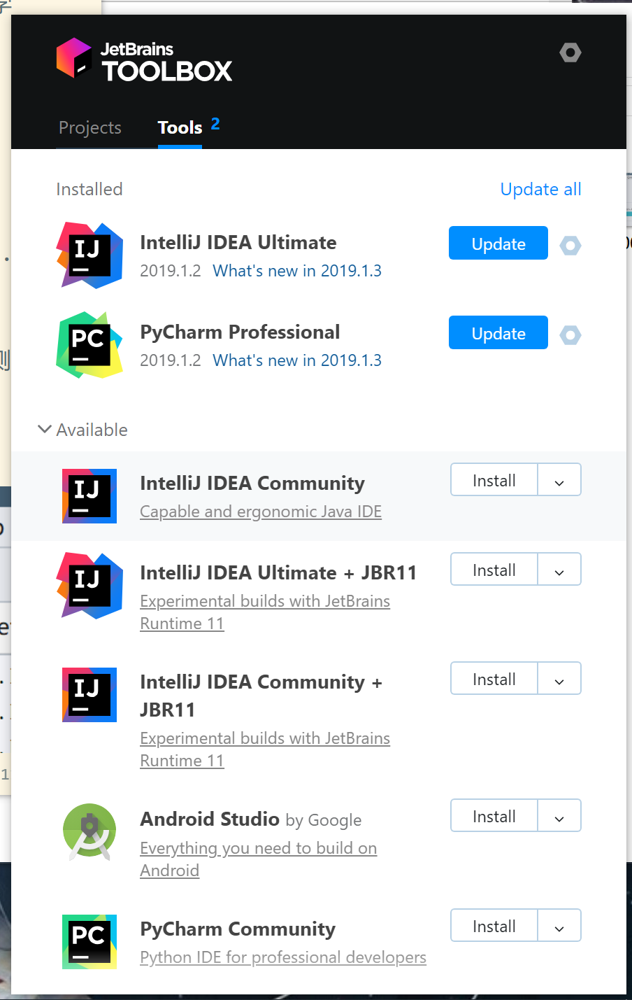

后续可能会用到Android Studio进行手机软件的开发.

认证你的学生邮箱就可以了,咱学校的学生邮箱海大在线应该就能看的吧,账号是学号,密码是海大在线的密码...

如果不行,或者你觉得麻烦的话...你可以私聊我用我的证书来正版验证.或者我帮你远程协助安装...

不过还是要有一点折腾精神的嘛~如果这点就嫌麻烦了的话...编程麻烦事还有好多好多的不管是前端后端还是测试...

打开IDEA,我们设置一些东西.

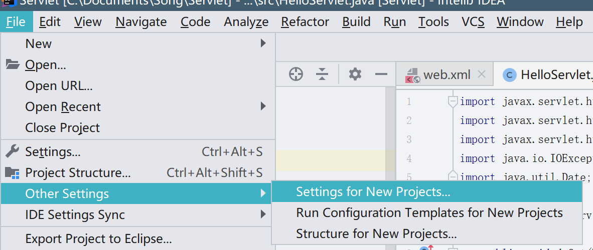

点击这个Other Settings...不然每次新项目都得重新设置.

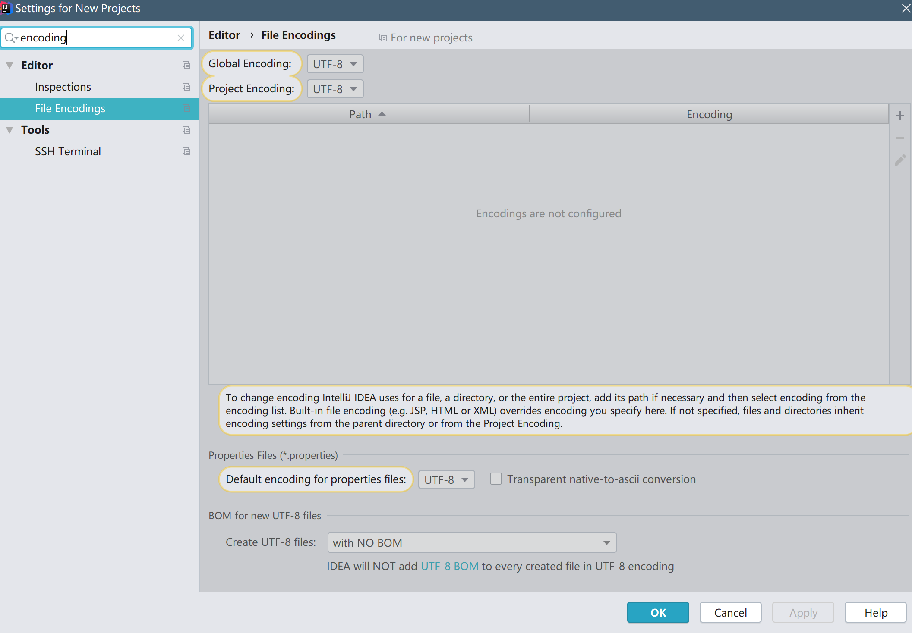

搜索encoding,将其中的内容都改成UTF-8

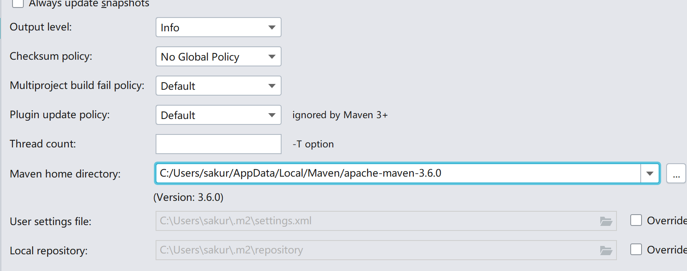

搜索maven,将home directory改成刚才解压的哪个目录.


这样就算配置完了~

如无特殊情况以后就再也不需要碰环境配置的问题了.

