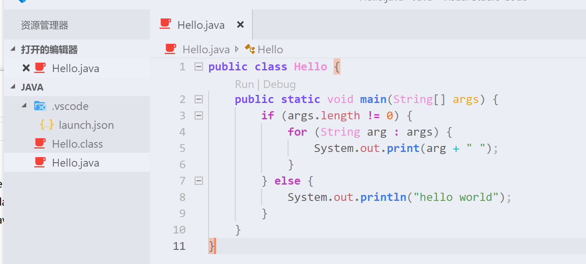

# 第2节: 基础语法

## Hello World

我们先使用VSCode吧...小程序使用VSCode写起来更方便点,IDEA打开就要好久...

打开VSCode,在拓展中搜索Java


安装该拓展就可以了,然后会提示重新加载.点一下等它重新加载就ok.

我们找一个目录用来放Java程序吧


我就放在这里了,然后右键打开VSCode



创建Hello.java,在其中输入如下内容

```java
public class Hello {
    public static void main(String[] args) {
        if (args.length != 0) {
            for (String arg : args) {
                System.out.print(arg + " ");
            }
        } else {
            System.out.println("hello world");
        }
    }
}
```

解释下代码

```java
public static void main(String[] args)
```

每个编程语言写的程序都要有一个入口对吧~这句话就像C语言的void main()或者int main(),是一个约定俗成的写法...

为什么要加static?学JSP和C#的时候还是记得的吧,要使用一个类的方法必须先使用new创建该类的一个实例后调用,而static声明的变量和方法是不需要实例也可以使用的...而作为一个程序的入口,自然是要求不用实例也可以使用的,所以是用static声明的...

至于(String[] args ?)我们先运行一下试试吧~

在VSCode的终端中输入javac Hello.java

``` po
javac Hello.java
java Hello
java Hello 你好 世界
```


第一句话是将java文件编译成字节码文件,也就是后缀为class的那个.

第二句话是运行该字节码文件,使用java命令.

第三句话我们在后面增加了两个字符串"你好"和"世界"

可以看到输出了你好 世界...

现在我们再回头看看我们编写的main方法

```java
	public static void main(String[] args) {
        if (args.length != 0) {
            for (String arg : args) {
                System.out.print(arg + " ");
            }
        } else {
            System.out.println("hello world");
        }
    }
```

我们在终端中输入的变量会赋值给args这个字符串列表,所以我们可以直接通过args访问到我们终端中输入的数据.

然后我们判断有没有从终端中输入数据,如果输入了就遍历这个列表,并打印到终端上显示出来.没有输入就打印我们默认的hello world.

这样就介绍完了一个最基本的Java程序的构成.

然后我们整理一下程序目录...

在Hello.java第一行增加内容package basic;

然后创建目录basic,将Hello.java放进去,之前的Hello.class删掉.


解释下package是什么意思:

package是一个类似命名空间的东西,想一想世界上每天产出那么多Java程序,不可能没有名字相同的Java类吧?那么它们用什么区分呢?答案就是用包名(package)区分.package约定俗成是使用域名的倒序来书写,比如说www.baidu.com,那么package就应该是com.baidu.www类似这样子的...那么在不同package引用的话只需要import引入完整的类路径就可以使用了...比如我们的Hello,就需要使用import basic.Hello;来进行引入.

如果不写package,那么在不同package中的类是没法import的噢~

总结下都有什么:

1. Java的入口方法public static void main(String[] args)详解
2. 通过终端命令进行java程序编译及运行
3. 了解package的使用

接下来要写~是关于面向对象和面向接口编程.