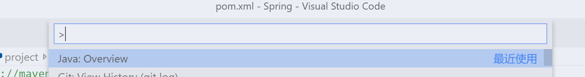
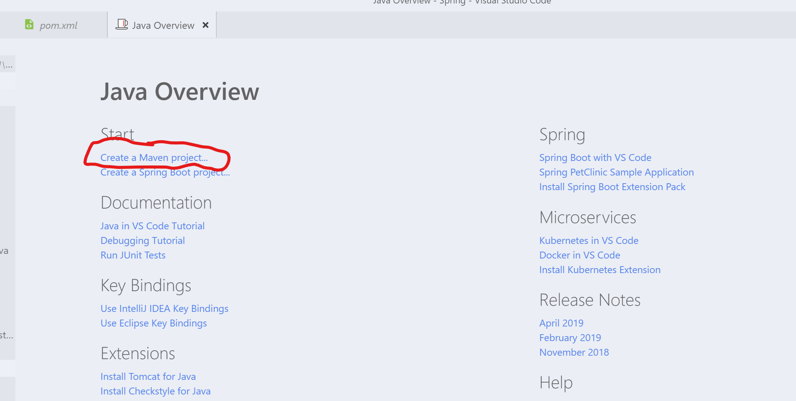
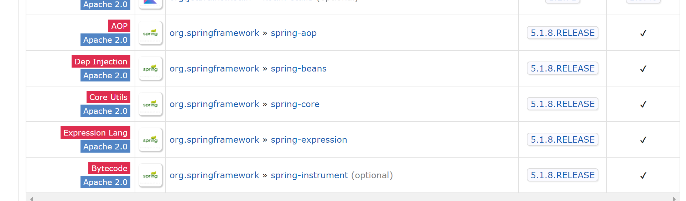
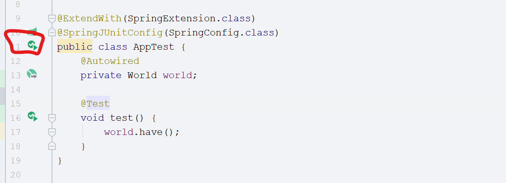

# Spring环境

## Maven项目

我们使用maven来管理Java程序.

maven之前有介绍过,相当于一个应用商店,你可以把它上面有的软件根据名字来下载到自己的项目里使用,同时也可以把自己的应用打包发布到maven的仓库里让别人来使用...

### VSCode

使用VSCode创建一个maven项目,流程如下:

打开VSCode,按下F1,搜索java overview





点击画圈部分,创建一个Maven项目.


选择一个原型,我们选择第三个jdk8就ok

然后会提示选择一个目录


会提示输入groupid,artifactid,version,package,根据自己喜好选择.


最终是这么一个目录.

### IDEA

可以选择使用IDEA,在新建项目中选择Maven


选择原型quickstart就可以了...之后是groupid和artifactid的填写...


两个工具创建的最终效果是一样的...因为IDEA更好用所以后续就用IDEA写了...

首先将pom.xml里的东西只留下如图部分.


不过其实properties里的东西也可以删掉的,因为之前在配置Java环境的时候已经把maven项目的默认编译版本都设置为Java 1.8了.不过我这里还是显式地留了下来.

然后我们百度maven repository,搜索spring-context...这个程序是spring环境的一个小集成


在下面的compile dependencies中可以看到大部分都是optional.翻到下面可以看到有四个不是可选的



分别是spring-aop,spring-beans,spring-core,spring-expression.这些我们之后或多或少都会用到.

我们把maven中那一串拷贝下来放到pom.xml的dependencies中


IDEA会提示让你import,导入后等它下载完成,应该就能在右边的maven侧栏中看到已经有了那四个程序.

这样我们的基本Spring框架的环境就搭建好了~使用maven可以简化很多我们的程序开发...

在没有maven的时候,我们需要去对应程序的官网下载它们提供的.jar后缀的应用,下载到本地后挨个导入到自己的程序中.

而有了maven,我们只需要再pom.xml中声明我们需要的依赖,maven就会自动地帮我们下载好,并且添加到我们的应用程序中.

然后简单说明下Spring是什么.

## Spring简介

Spring核心是通过IoC来使Java程序解耦,可以更方便的进行单元测试和团队协作.那什么是IoC.

IoC是inverse of control的简写,字面意思是控制反转...

比如说我们写的Sort排序程序.我们在使用的时候需要这样.

```java
public void useSort(){
    int[] a = new int[]{1,3,2,5,4};
    Sort sort = new BubbleSort();
    sort.sort(a);
}
```

那么很容易就可以想到在进行单元测试的时候我们不可避免地在测试useSort()方法地同时,也会测试到BubbleSort()方法,我们可能不想在测试的时候碰到这种强依赖的情况,在不看源代码的情况下你也不会知道这个方法强依赖BubbleSort().

并且这里的使用Sort方法都写死了为冒泡排序,我们如果想要更换排序方法得自己修改这里的代码,在团队协作的时候很不方便,如果这个useSort()是其它人写的,你需要修改别人的方法.而你又对它的代码不是很了解,可能不小心改错了什么的...因此我们需要解耦.

现在这个useSort()方法是强依赖BubbleSort()类的,我们将它修改修改.

```java
public class Test{
    Sort sort;
    public Test(Sort sort){
        this.sort=sort;
    }
    public void useSort(){
        int[] a = new int[]{1,2,4,2,3};
        sort.sort(a);
    }
}
```

这样就将两个类进行了解耦,我们在创建这个Test实例的时候,利用构造方法传入一个Sort实例,在Test内部是没有实例化其他类的.当然这里除了这个int[] a,不过这个int[] a也是可以用这种方式就行解耦的,不过就目前而言没什么必要而已2333毕竟只是一个简单的示例,你也可以把int[] a利用这种方式来进行解耦.

我们在单元测试的时候,将我们已经测试好的类实例化,然后传给这个Test就可以了,如下代码

```java
public static void main(String[] args){
    Sort sort = new MergeSort();
    Test test = new Test(sort);
    test.useSort();
}
```

跟之前的写法有些许不同对吧...

那么什么是控制反转呢?在最初我们写的有强依赖的类中,我们是自己实例化了一个Sort来使用.

在后来解耦的这个版本,我们是在类的构造方法里声明了我们需要一个Sort类型的实例,然后由调用者来自己决定传哪一个Sort实例给我们.

本来我们依赖的类是我们自己用new关键字实例化的,控制反转则是告诉别人我们需要这个类的实例,你给我传进来让我用.

这就是Spring的核心控制反转.

控制反转同时也叫做依赖注入,这两个是一个东西的根据不同的理解所得到的不同称呼而已.

依赖注入就很好理解了嘛,我们把一个类的实例注入到另一个需要它的类中~

那么Spring是什么呢?

我们先简单写一个例子吧~先创建一个SpringConfig类,在上面增加两个注解@Configuration和@ComponentScan

```java
package com.dlmu;

import org.springframework.context.annotation.ComponentScan;
import org.springframework.context.annotation.Configuration;

@Configuration
@ComponentScan
public class SpringConfig {
}
```

这样就可以了.

然后我们创建几个简单的类用来测试.

```java
import org.springframework.stereotype.Component;

@Component
public class Animal {
    public void run(){
        System.out.println("animal can run");
    }
}

import org.springframework.beans.factory.annotation.Autowired;
import org.springframework.stereotype.Component;

@Component
public class World {
    @Autowired
    private Animal animal;

    public void have() {
        animal.run();
    }
}
```

创建了三个类,其中一个为Animal,一个为World.

之前在解耦的时候我们手动在调用的时候用new实例化一个类并且进行了注入,而Spring会帮我们进行类的实例化和注入.简单看下代码.

其中被@Component标识的类会被Spring管理,这样Spring就知道了这个类是需要它来进行管理的.

可以观察到我们在World中并没有使用new实例化一个对象,只是在成员变量上增加了@Autowired注解就直接使用了animal的方法.回过头看看我们的SpringConfig类

其中的

@Configuration注解声明该类为一个Spring配置类.

@ComponentScan告诉Spring应该扫描哪些类.默认为该配置类所在包下的所有类.

现在普通地使用main方法是没有办法进行测试的,原因以后再写吧...现在只需要知道就好了...

我们使用Spring提供的spring-test和junit来进行测试.

同样的在maven里搜spring-test和junit,并添加到pom.xml中.

最终如下.

```xml
  <dependencies>
    <!-- https://mvnrepository.com/artifact/org.springframework/spring-context -->
    <dependency>
      <groupId>org.springframework</groupId>
      <artifactId>spring-context</artifactId>
      <version>5.1.8.RELEASE</version>
    </dependency>
    <!-- https://mvnrepository.com/artifact/org.springframework/spring-test -->
    <dependency>
      <groupId>org.springframework</groupId>
      <artifactId>spring-test</artifactId>
      <version>5.1.8.RELEASE</version>
      <scope>test</scope>
    </dependency>
    <!-- https://mvnrepository.com/artifact/org.junit.jupiter/junit-jupiter-api -->
    <dependency>
      <groupId>org.junit.jupiter</groupId>
      <artifactId>junit-jupiter-api</artifactId>
      <version>5.5.0-RC2</version>
      <scope>test</scope>
    </dependency>
  </dependencies>
```

然后我们修改test目录下的AppTest类如下

```java
package com.dlmu;

import org.junit.jupiter.api.Test;
import org.junit.jupiter.api.extension.ExtendWith;
import org.springframework.beans.factory.annotation.Autowired;
import org.springframework.test.context.junit.jupiter.SpringExtension;
import org.springframework.test.context.junit.jupiter.SpringJUnitConfig;

@ExtendWith(SpringExtension.class)
@SpringJUnitConfig(SpringConfig.class)
public class AppTest {
    @Autowired
    private World world;

    @Test
    void test() {
        world.have();
    }
}
```

ExtendWith注解是Junit提供给我们的,它告诉Junit我们使用了Spring.

下面的是Spring-test提供的注解,它告诉spring-test我们的配置文件是哪个.

我们点击绿色箭头运行下~




可以看到我们没有使用任何new来创建实例,但是整个程序却跑起来了~

这就是Spring最核心的部分.

所有被Spring管理的类被称作bean,也就是之前我们使用Component注解标识的类,当然SpringConfig和AppTest也是bean,它们也被Spring管理.

我们可以在SpringConfig类中来配置该如何生成一个类的实例,不过目前我们使用@Component进行了自动装配bean,而没有自定义配置.

所以回头想想spring-context中的四个依赖,其中两个我们已经用上了,spring-core和spring-bean.

spring-bean就是管理所有的bean,所有的bean都有生命周期,而不是说从应用程序开始就实例化,然后到结束才销毁这么简单.

spring-core自然就是依赖注入的部分了~

剩下两个依赖在接下来会慢慢都用到的~目前先就这些了~