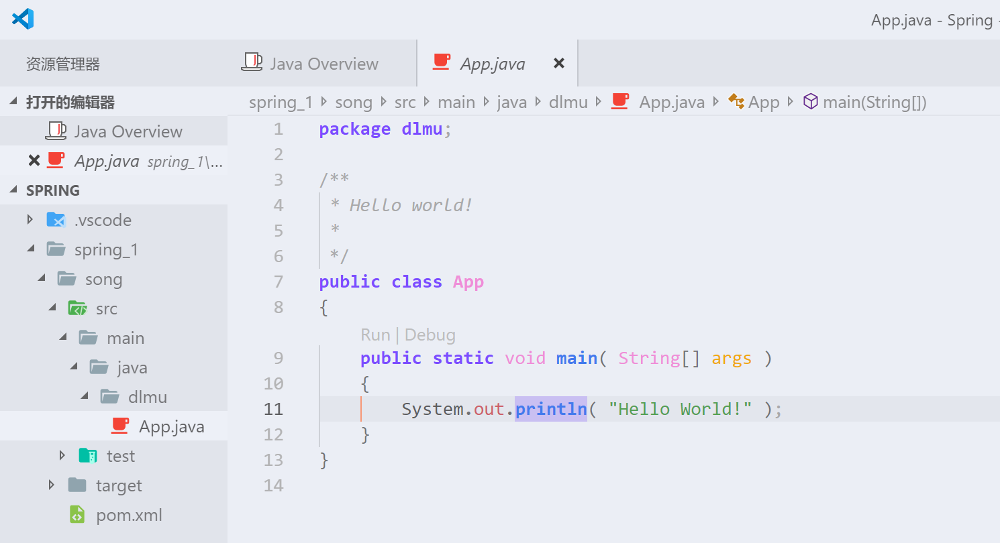

# Spring简单使用

可以选择使用IDEA,在新建项目中选择Maven

选择原型quickstart就可以了...之后是groupid和artifactid的填写...

打开VSCode,按下F1,搜索java overview

点击画圈部分,创建一个Maven项目.

选择一个原型,我们选择第三个jdk8就ok

然后会提示选择一个目录

会提示输入groupid,artifactid,version,package,根据自己喜好选择.

最终是这么一个目录.

两个工具创建的最终效果是一样的...因为IDEA更好用所以后续就用IDEA写了...