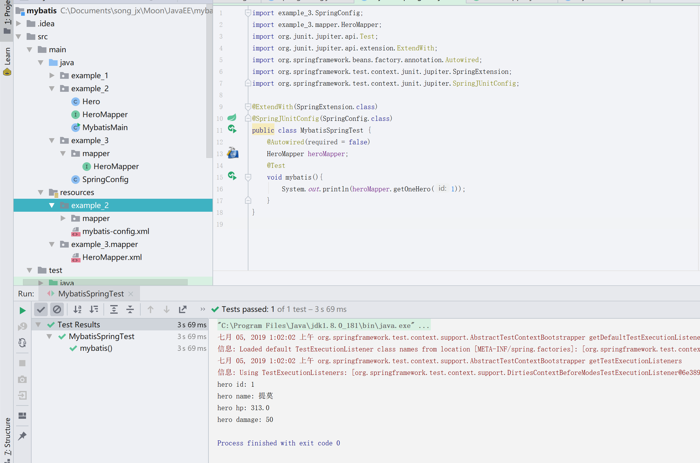
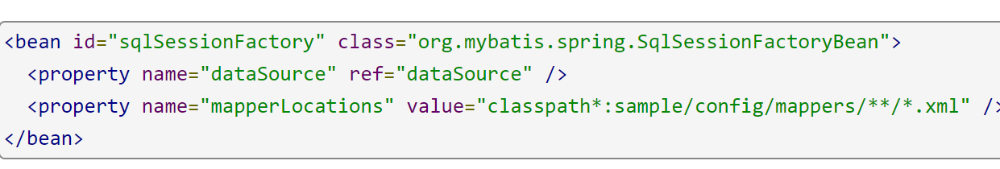
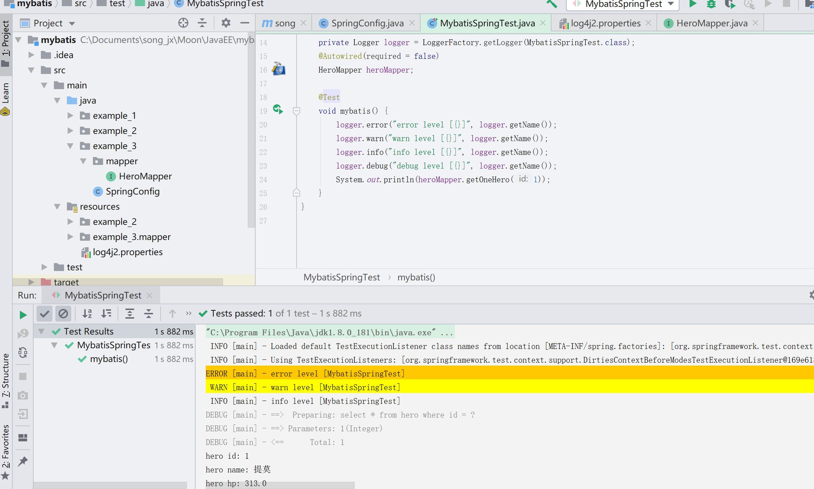

# Mybatis-Spring

**[示例代码](https://github.com/songjunxia70223/JavaEE/tree/master/mybatis/src/main/java/example_3)**

## 整合Mybatis

### 方法

单独使用Mybatis依旧有很多模板代码要写,它只是解决了从数据到对象的映射关系这一需求,我们仍然需要管理它的一些模板代码,以及一些会话的生命周期,这些都可以使用Spring来帮我们简化掉.

所以这节先写两个整合在一起使用,下一节写简单的增删改查.

```xml
		<dependency>
            <groupId>org.mybatis</groupId>
            <artifactId>mybatis-spring</artifactId>
            <version>2.0.1</version>
        </dependency>
		<!-- https://mvnrepository.com/artifact/org.springframework/spring-jdbc -->
        <dependency>
            <groupId>org.springframework</groupId>
            <artifactId>spring-jdbc</artifactId>
            <version>5.1.8.RELEASE</version>
        </dependency>
        <!-- https://mvnrepository.com/artifact/org.springframework/spring-context -->
        <dependency>
            <groupId>org.springframework</groupId>
            <artifactId>spring-context</artifactId>
            <version>5.1.8.RELEASE</version>
        </dependency>
        <!-- https://mvnrepository.com/artifact/org.junit.jupiter/junit-jupiter-api -->
        <dependency>
            <groupId>org.junit.jupiter</groupId>
            <artifactId>junit-jupiter-api</artifactId>
            <version>5.5.0</version>
            <scope>test</scope>
        </dependency>
		<dependency>
            <groupId>org.springframework</groupId>
            <artifactId>spring-test</artifactId>
            <version>5.1.8.RELEASE</version>
            <scope>test</scope>
        </dependency>
```

我们在上一节的pom.xml中增加如上内容,分别是spring包,mybatis-spring包,spring-jdbc包和单元测试的两个包.

其中mybatis-spring是通过spring管理mybatis的生命周期,spring-jdbc是通过spring管理jdbc的生命周期,毕竟本质上mybatis是对jdbc的封装.

添加完后我们创建一个SpringConfig类用来配置整合.

我们首先看看上一节使用mybatis的流程.

```java
		String resource = "mybatis-config.xml";
        InputStream inputStream = null;
        try {
            //读取配置文件的内容
            inputStream = Resources.getResourceAsStream(resource);
        } catch (IOException e) {
            e.printStackTrace();
        }
        //根据配置文件创建一个会话工厂		
		SqlSessionFactory sqlSessionFactory = new SqlSessionFactoryBuilder().build(inputStream);
        //根据会话工厂创建一个会话,每个线程都应该有自己的会话.
        //也就是说多用户的情况下,每个用户都应该有一个自己的会话.
        SqlSession session = sqlSessionFactory.openSession();
```

这部分代码,同样的我们使用Spring的时候也是这样子配置的.

那么之前mybatis-config.xml里面是什么东西呢?

```xml
		<environment id="development">
            <transactionManager type="JDBC"/>
            <dataSource type="POOLED">
                <property name="driver" value="com.mysql.cj.jdbc.Driver"/>
                <property name="url" value="jdbc:mysql://localhost:3306/jdbc?serverTimezone=Asia/Shanghai"/>
                <property name="username" value="root"/>
                <property name="password" value="ilikeshe2"/>
            </dataSource>
        </environment>
```

可以看到设置了一个数据源.所以我们在SpringConfig里先创建一个DataSource类型的Bean,内容如下.

```java
@Configuration
public class SpringConfig {
    @Bean
    public DataSource dataSource(){
        PooledDataSource dataSource = new PooledDataSource();
        dataSource.setDriver("com.mysql.cj.jdbc.Driver");
        dataSource.setUsername("root");
        dataSource.setPassword("ilikeshe2");
        dataSource.setUrl("jdbc:mysql://localhost:3306/jdbc?serverTimezone=Asia/Shanghai");
        return dataSource;
    }
}
```

我们使用的是PooledDataSource数据源,它是mybatis对DataSource接口的一个实现,对应了我们上一节指定的POOLED.其实上一节我们通过mybatis-config.xml里设置为POOLED指定的就是该PooledDataSource.使用了一个效率并不高的数据库连接池.不过由于所有的数据源都实现了DataSource接口,所以我们修改数据库连接池的时候只需要更改它的实现类就可以了.比如Hikari数据库连接池的DataSource实现.回头再改.

然后我们需要一个SqlSessionFactory对吧~

所以完整代码如下.

```java
@Configuration
public class SpringConfig {
    @Bean
    public DataSource dataSource(){
        PooledDataSource dataSource = new PooledDataSource();
        dataSource.setDriver("com.mysql.cj.jdbc.Driver");
        dataSource.setUsername("root");
        dataSource.setPassword("ilikeshe2");
        dataSource.setUrl("jdbc:mysql://localhost:3306/jdbc?serverTimezone=Asia/Shanghai");
        return dataSource;
    }
    @Bean
    public SqlSessionFactory sqlSessionFactory() throws Exception {
        //通过SqlSessionFactoryBean来构建一个SqlSessionFactory.
        SqlSessionFactoryBean factoryBean = new SqlSessionFactoryBean();
        factoryBean.setDataSource(dataSource());
        return factoryBean.getObject();
    }
}
```

由于我们mybatis-config.xml里的内容使用Java代码的方式代替了,还少了什么呢?

少了Mapper的扫描对吧~首先要扫描我们的*.xml文件,然后是扫描对应的接口~

所以我们在类上添加如下注解.

> @MapperScan("example_3.mapper")

这个表明的是我们的mapper接口所在的包名

之后我们可以再factoryBean的方法中找到setMapperLocations方法,它就是用来设置*.xml的地方的.

我们可以看到它接受一个Resource列表类型的参数.

Resource[]我们可以用ResourcePatternResolver来快速获取,可以用*通配符来获取多个mapper.xml

使用方法如下.

> ```java
> ResourcePatternResolver resolver = new PathMatchingResourcePatternResolver();
> Resource[] resources = resolver.getResources("example_3/mapper/*.xml");
> factoryBean.setMapperLocations(resources);
> ```

在原来的SqlSessionFactory中增加上面这三行就可以了.

之后就是Mapper.xml,Mapper.java的编写.内容和上一节的一样.具体路径参考下面的截图就ok.

我们使用Junit来测试下看看吧~



其中example_2的内容对应的上一节的内容.example_3对应的本节的项目目录.

至于为什么这里要加required=false,因为实际上我们的HeroMapper是使用@MapperScan注解进行扫描,mybatis帮我们提供了实现类的,但是IDEA并不知道,IDEA会以为我们没有写HeroMapper接口的实现,所以不加这个会报warning,但是运行是没有问题的...防止看着心烦所以就加上这个了~

只要写好上面的配置,之后只需要编写mapper.xml和mapper.java就可以操作数据库了,是不是便利了很多呢~

当然创建factoryBean还有很多配置,大致都对应了mybatis-config.xml里可以进行的操作.

到这里为止,有没有对spring的使用有更深刻的理解呢?

### 思考

上面的配置代码网上是没有完全一样的...这需要自己思考,mybatis-spring的官方文档里面涉及到一些配置,它里面的例子有些依旧是使用了mybatis-config.xml进行了配置.但是我们如果想完全使用Java代码的话,就根据它的代码参数提示,来自己在Java代码里配置所需要的Bean.

比如说这里的SqlSessionFactoryBean,官网里有使用spring.xml的方式配置的例子



我们要改成Java代码就需要观察,首先可以看到class里面的类型是SqlSessionFactoryBean,所以如果我们使用Java代码配置Spring的话也需要创建一个SqlSessionFactoryBean类型的Bean.

然后它的属性里有Datasource和mapperLocations,所以我们使用SqlSessionFactoryBean创建SqlSessionFactory的时候也需要提前配置好Datasource和mapperLocations.

至于怎么配置Datasource,MapperLocations的Bean,网上是有代码的.

其中DataSource的实现有很多,随便用一个都行,比如UnPolledDataSource,PooledDataSource......

mapperLocations根据它的参数类型提示来配置.

setMapperLocations方法接受一个Resource[],我们可以从百度搜到Resource接口有很多种实现,比如ClassPathResource,FileSystemResource.基本上都是根据字符串获取资源(比如说.xml配置文件).同时我们可以找到一个获得Resource[]列表的方法,就是我们上面用到的ResourcePatternResolver,翻译过来就是资源模式解析.也就是可以根据通配符来获取多个Resource.

我们可以Ctrl+鼠标左键点进去看看SqlSessionFactoryBean里有什么方法,都是很直观就能知道做什么的.

其他诸如DataSource也是如此.根据方法名称来猜它是做什么的,根据参数名称来推理它需要什么东西.这样即使不百度你也能通过这样推理来大致完成自己需要的功能.

需要学会的是使用这些工具的方法...这些工具本身就是为了更方便的开发功能而写出来的,我们只相当于是用户罢了,没什么难度的...所以一昧的Copy Paste是没什么意义的...重要的是理解这些代码的作用,同时根据这些工具开发者的提示(包括类的命名,方法命名,参数命名)来使用这些工具.

## 日志

我们可以通过日志来查看Mybatis帮我们进行的SQL语句操作,这里我们使用slf4j.

slf4j是Simple Logging Facade for Java,不是具体的日志解决方案，它只服务于各种各样的日志系统。按照官方的说法，SLF4J是一个用于日志系统的简单[Facade](https://baike.baidu.com/item/Facade)，允许最终用户在部署其应用时使用其所希望的日志系统.

简单说slf4j通过调用其他的日志系统来进行日志方案的解决.目的是为了统一日志系统.

所以除了slf4j以外我们还需要一个实现,现在常用的是log4j.

我们加入以下三个依赖

```xml
		<!-- https://mvnrepository.com/artifact/org.apache.logging.log4j/log4j-core -->
        <dependency>
            <groupId>org.apache.logging.log4j</groupId>
            <artifactId>log4j-core</artifactId>
            <version>2.12.0</version>
        </dependency>
        <!-- https://mvnrepository.com/artifact/org.apache.logging.log4j/log4j-slf4j-impl -->
        <dependency>
            <groupId>org.apache.logging.log4j</groupId>
            <artifactId>log4j-slf4j-impl</artifactId>
            <version>2.12.0</version>
        </dependency>
        <!-- https://mvnrepository.com/artifact/org.slf4j/slf4j-api -->
        <dependency>
            <groupId>org.slf4j</groupId>
            <artifactId>slf4j-api</artifactId>
            <version>1.7.26</version>
        </dependency>
```

第一个是log4j的core,第二个是从log4j到slf4j的桥接,第三个是slf4j.

然后我们需要配置一下,默认的配置文件是在resources下的log4j2.properties.

我们加入以下内容.

```properties
appender.console.type = Console
appender.console.name = STDOUT
appender.console.layout.type = PatternLayout
appender.console.layout.pattern = %5p [%t] - %m%n
logger.rolling.name = example_3.mapper
logger.rolling.level = debug

rootLogger.level = info
rootLogger.appenderRef.stdout.ref = STDOUT
```

常见的日志级别是ERROR、WARN、INFO、DEBUG.越往下打印的内容越多,也就是说INFO除了DEBUG都打印,而DEBUG会打印所有级别的日志.在上面的配置文件中,我们将信息打印到控制台,第四个是配置输出格式的.

然后我们将example_3.mapper包下的日志级别设置为debug,然后全局是info.

我们在测试代码中加入下面的属性.

> private Logger logger = LoggerFactory.getLogger(MybatisSpringTest.class)

在测试的方法中加入下面的代码.

> ```java
> logger.error("error level [{}]", logger.getName());
> logger.warn("warn level [{}]", logger.getName());
> logger.info("info level [{}]", logger.getName());
> logger.debug("debug level [{}]", logger.getName());
> ```

然后运行下看看.



可以看到HeroMapper的查询语句在控制台输出了,然而我们在测试方法中写的debug级别的log并没有打印出来~

因为我们rootLogger中配置的级别是Info,只有高于info级别的log才会打印.

logger.getName()获取的是之前我们用LoggerFactory创建日志的时候传递的MybatisSpringTest.class的名字,如果我们传递的是HeroMapper,那么getName()获取到的就是exampl_3.mapper.HeroMapper...

日志是用来在系统上线后进行排错的...毕竟写的程序不可能完全正确,当运行中由于一些没测试到的问题出现了错误的时候,就可以通过日志中的信息进行排错,然后修改代码debug.

下一节会写Mybatis中使用缓存.然后就不会再更新Mybatis了...基本上就是对SQL语句的各种拼接而已.非常简单,看官方文档就可以了...后续会在其他用到Mybatis的时候可能会出现例子.

