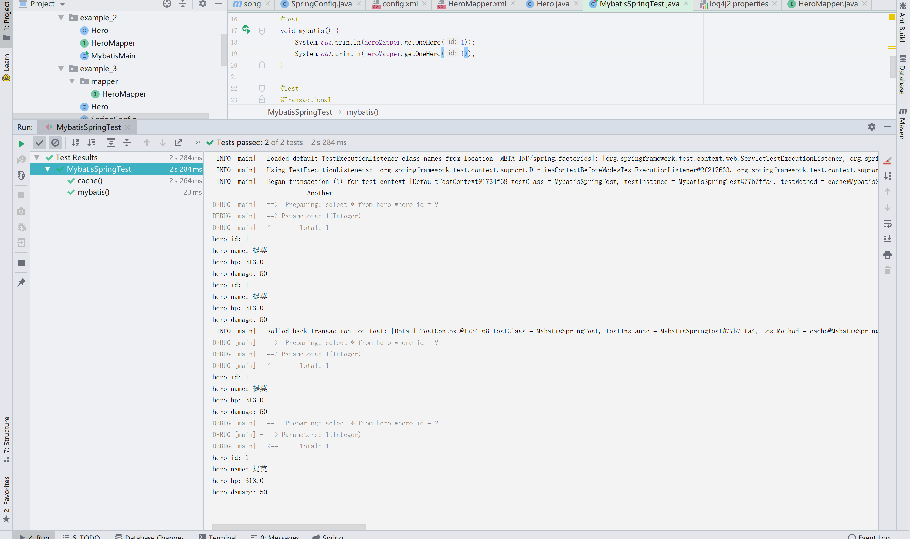
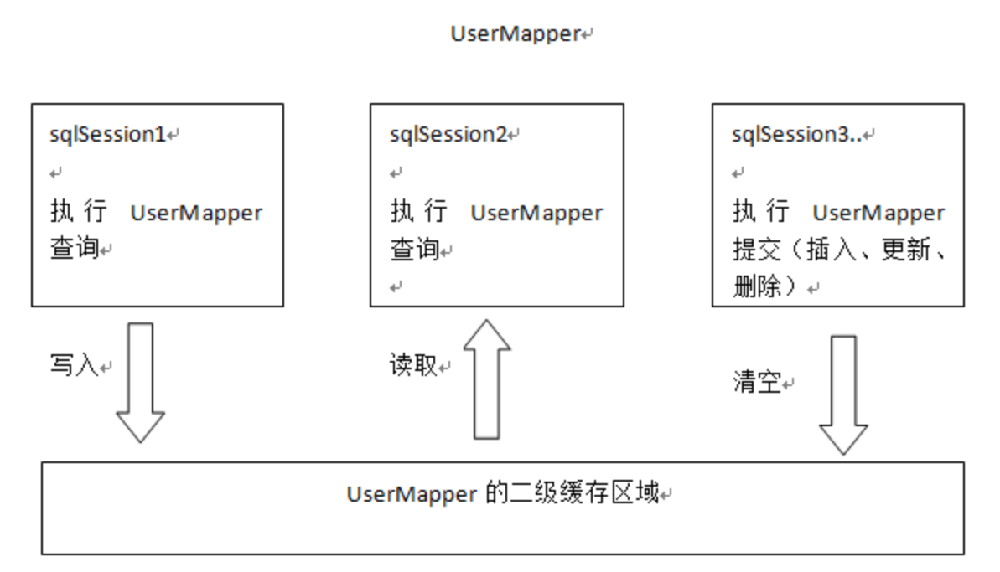
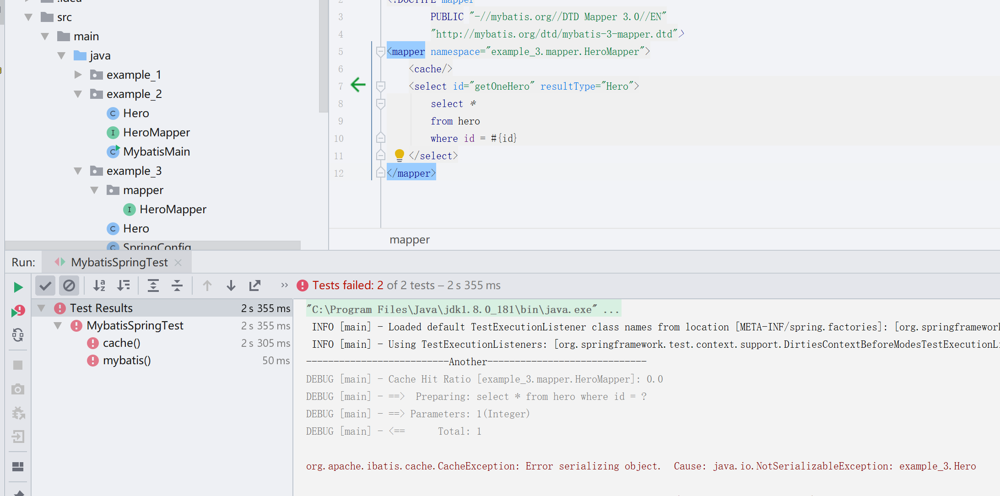
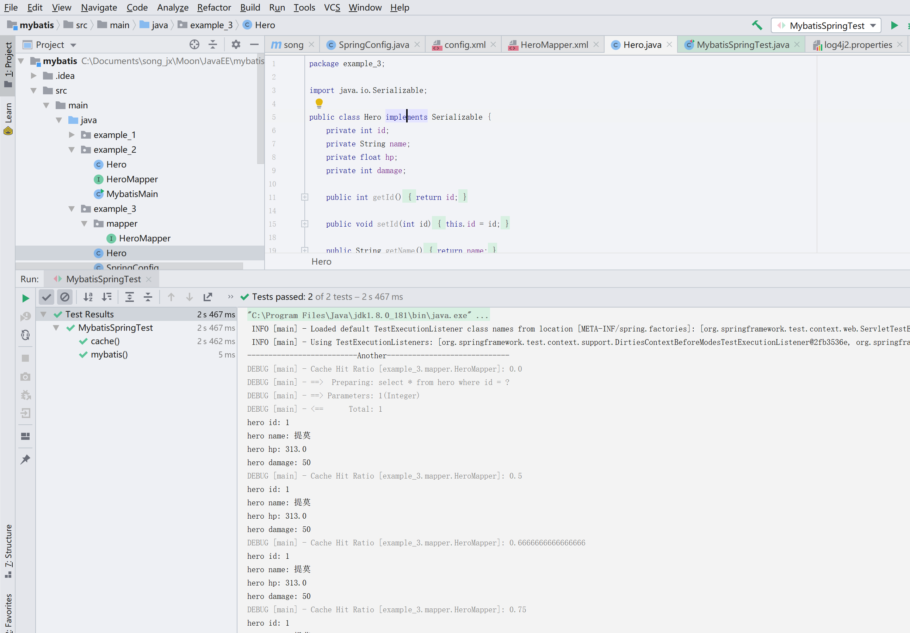

# Mybatis缓存

**[示例代码](https://github.com/songjunxia70223/JavaEE/tree/master/mybatis/src/main/java/example_3)**

## 一级缓存

什么是一级缓存?在mybatis中,同一个SqlSession进行查询的时候,如果查询的SQL是一模一样的,它会把上一次使用该SQL查询的结果直接返回.

也就是说如果执行下列代码,只会从数据库中取一次数据.

```java
		SqlSession session = sqlSessionFactory.openSession();
        //使用会话创建一个Mapper的实现,参数为实际我们想要得到的Mapper类
        HeroMapper mapper = session.getMapper(HeroMapper.class);
        //根据mapper中的方法从数据库中查询数据
        Hero hero = mapper.getOneHero(1);
		Hero hero = mapper.getOneHero(1);
```

但是在整合到Spring的时候,我们的SqlSession实际上是从SqlSessionTemplate中获得的...具体流程是这样子的

>1. 我们需要访问数据
>2. spring检查到了这种需求，于是去申请一个mybatis的sqlsession,并将申请到的sqlsession与当前线程绑定，放入threadlocal里面.
>3. sqlSessionTemplate从threadlocal获取到sqlsession，去执行查询
>4. 查询结束，清空threadlocal中与当前线程绑定的sqlsession，释放资源
>5. 我们又需要访问数据
>6. 又重新回到步骤2

所以每次查询得到的SqlSession是不一样的.而如果开启事务的话可以确保在一个方法中的所有查询在一个Session中进行.

所以我们现在SpringConfig中增加一个事务管理的Bean,内容如下

```java
	@Bean
    public DataSourceTransactionManager transactionManager(){
        DataSourceTransactionManager transactionManager = new DataSourceTransactionManager();
        transactionManager.setDataSource(dataSource());
        return transactionManager;
    }
```

代码很简单...具体百度DataSourceTransactionManager吧,这个是spring框架提供的jdbc的数据库事务管理的实现类.

然后我们修改测试代码如下.

```java
public class MybatisSpringTest {
    private Logger logger = LoggerFactory.getLogger(MybatisSpringTest.class);
    @Autowired(required = false)
    HeroMapper heroMapper;

    @Test
    void mybatis() {
        System.out.println(heroMapper.getOneHero(1));
        System.out.println(heroMapper.getOneHero(1));
    }

    @Test
    //使用Transactional开启事务.
    @Transactional
    void cache() {
        System.out.println("--------------------------Another-----------------------------");
        System.out.println(heroMapper.getOneHero(1));
        System.out.println(heroMapper.getOneHero(1));
    }
}
```



我们可以从结果中看到,在开启事务的哪个测试方法中,虽然有两次查询,但是只出现了一次查询语句,而没开启事务的测试方法中则有两次查询语句,总共出现了三次查询语句

所以默认整合后Mybatis会在事务中体现一级缓存的表现.

不过在进行插入更新删除操作后会清空一级缓存中的数据.

## 二级缓存

一级缓存是在SqlSession内部共享的.很容易就能想到二级缓存是在SqlSession之间共享数据的.



这个是网上找到的关于两个缓存之间的关系.

使用二级缓存我们需要配置一下下.

我们可以观察到SqlSessionFactoryBean类的方法中有一个setConfiguration.

这个方法的参数是Resource.我们可以猜出这个方法接受一个资源,资源应该是一个配置文件.

很容易想到这个配置文件是我们以前使用过的mybatis-config.xml~

所以我们在resource/example_3/目录下创建一个config.xml的mybatis配置文件.

内容如下

```xml
<?xml version="1.0" encoding="UTF-8" ?>
<!DOCTYPE configuration
        PUBLIC "-//mybatis.org//DTD Config 3.0//EN"
        "http://mybatis.org/dtd/mybatis-3-config.dtd">
<configuration>
    <settings>
        <setting name="cacheEnabled" value="true"/>
    </settings>
</configuration>
```

然后再SqlSessionFactoryBean中set这个配置文件.现在这个Bean的全部代码如下.

```java
	@Bean
    public SqlSessionFactory sqlSessionFactory() throws Exception {
        SqlSessionFactoryBean factoryBean = new SqlSessionFactoryBean();
        factoryBean.setDataSource(dataSource());
        ResourcePatternResolver resolver = new PathMatchingResourcePatternResolver();
        Resource[] resources = resolver.getResources("example_3/mapper/*.xml");
        factoryBean.setMapperLocations(resources);
        factoryBean.setConfigLocation(new ClassPathResource("example_3/config.xml"));
        return factoryBean.getObject();
    }
```

然后再在HeroMapper.xml中添加该标签就可以了,当然还有别的一些选项,这里我们默认就可以了.

> <cache/>

这里说明下二级缓存的作用域,二级缓存是基于namespace中的,不同namespace的二级缓存互不影响.namespace也就是&lt;mapper namespace=""&gt;中指定的Mapper.java.简单说就是每个Mapper的缓存时独立的,不同mapper的二级缓存是不共享的.不过可以用&lt;cache-ref namespace="" &gt;来引用其他命名空间的缓存.

然后我们简单修改下代码,将@Transactional注解删掉,重新运行一下代码看看~



我们发现它报错了,报错信息是Error serializing object. NotSerializableExcaption: example_3.Hero

也就是说我们的Hero是不能序列化的.所以我们让Hero implements Serializable接口再重新试试.



我们发现每次查询的时候都会出现Cache Hit Ratio,翻译过来就是缓存命中率.

计算方法很简单~我们第一次查询的时候在二级缓存中没有该数据对吧~然后就需要从数据库中查询,所以目前命中率是0,查询到数据后将其序列化并存入二级缓存中.

第二次查询从缓存中找到了该数据,总计两次查询命中一次,所以是0.5

第三次为三次查询命中二次,0.666666

第四次为四次查询命中三次,0.75

二级缓存就不需要事务也可以体现出来了~

使用方法很简单吧~

**二级缓存的使用原则**

1. 多个namespace不操作同一张表
   由于二级缓存中的数据是基于namespace的，即不同namespace中的数据互不干扰。在多个namespace中若均存在对同一个表的操作，那么这多个namespace中的数据可能就会出现不一致现象。
2. 在单表上使用二级缓存 
   如果一个表与其它表有关联关系，那么久非常有可能存在多个namespace对同一数据的操作。而不同namespace中的数据互补干扰，所以就有可能出现多个namespace中的数据不一致现象。
3. 查询多于修改时使用二级缓存 
   在查询操作远远多于增删改操作的情况下可以使用二级缓存。因为任何增删改操作都将刷新二级缓存，对二级缓存的频繁刷新将降低系统性能。

不过使用cache-ref可以多个namespace共享同一个缓存.也就是上面的这些原则中所谓的问题是有办法避免的...不过实际上缓存能带来多大的收益还是需要权衡下...还有由此带来的一系列可以想象的复杂度...

嘛不过我也没做过什么大型系统的...这些目前还没了解到...等我什么时候踩坑了会在这里更新一下的...

到目前为止Mybatis的使用就写完了...别的我觉得都没什么可以写的...官方文档看一遍就会了...属于看了就会,用了就能记住的东西...